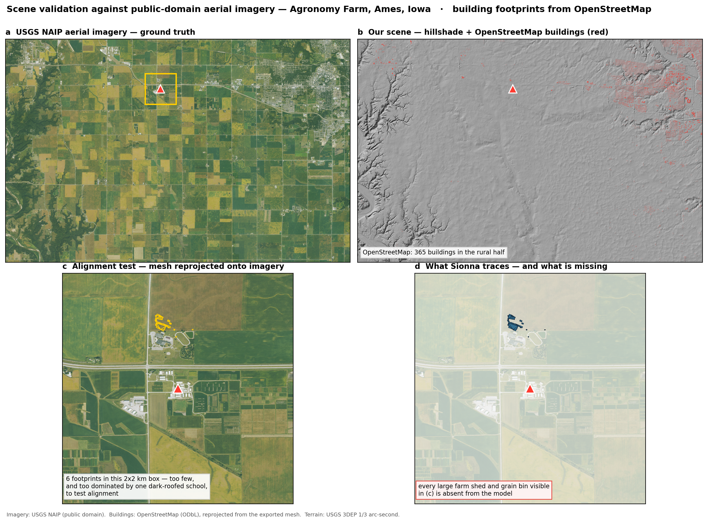
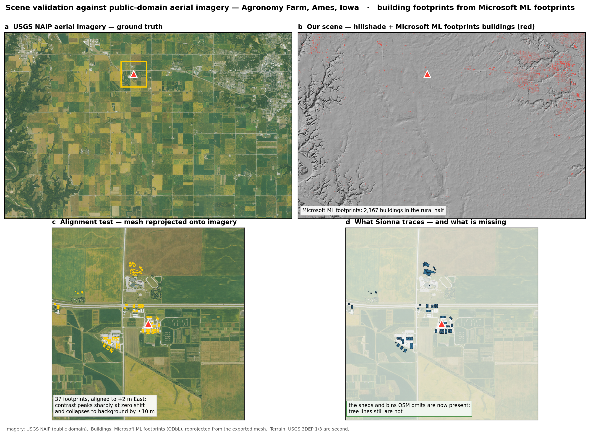
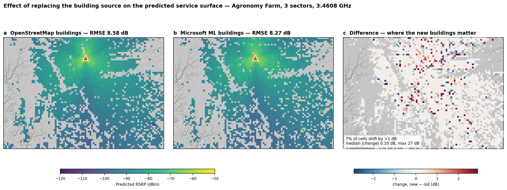

# Sionna approach — physics-based ray tracing

**ARATHON CHALLENGE 03** · Data-driven rural infrastructure placement

One of several approaches in this repository ([overview](../README.md)). This one builds a
geometric digital twin of the testbed and ray-traces it, rather than fitting a statistical
model to the measurements.

A ray-traced RF digital twin of the ARA rural COTS RAN testbed near Ames, Iowa. A UE
drive test covers 7% of the area; ray tracing over real terrain and building geometry
predicts the rest, and the predicted service surface becomes the input to a constrained
facility-location problem.


Scene validated against public-domain aerial imagery. Georeferencing is confirmed, but
OpenStreetMap records only 6 buildings within 2 km of the serving site:



Microsoft's ML-extracted footprints raise that to 37, and improve held-out RMSE from
8.58 dB to **8.27 dB** — the largest single gain of any change tested:



The effect on the service surface is concentrated rather than uniform: 7% of cells shift by
more than 1 dB, with a median absolute change of 0.10 dB and a maximum of 27 dB.



## Status

| Stage | State |
|---|---|
| Scene construction (terrain + OSM buildings, georeferenced) | **done** |
| Mitsuba export, Sionna RT loading, ITU materials | **done** |
| Propagation model calibrated against measured RSRP | **9 dB RMSE — usable, not yet good** |
| Predicted service surface over the unmeasured area | **done** |
| Facility-location optimisation | **not started** |

Full write-up: **[REPORT.md](REPORT.md)**.

Honest headline: on spatially disjoint held-out blocks the twin reaches **RMSE 8.58 dB,
r = 0.83, bias +1.8 dB** (n = 1,762). 57% of grid cells get a modelled path; the rest are
a known gap, not an absence of coverage. Antenna height, tilt and EIRP are not in the
dataset — EIRP and gain are absorbed into one fitted constant, and height is currently
asserted at 30 m because it is **not identifiable** from the data (see `HANDOFF.md`).

## Quickstart

```bash
pip install sionna-rt
cd scene

# CUDA GPU: no extra setup, and raise the chunk size / refine the grid
RT_CHUNK=8000 python predict_surface.py mitsuba/ames.xml 30 pred.npz 100

# CPU: Sionna will not import without this
export DRJIT_LIBLLVM_PATH=/path/to/libLLVM.dylib
python predict_surface.py mitsuba/ames.xml 30 pred.npz 200

python make_figure.py pred.npz out.png
```

The 30 m Mitsuba scene is committed, so this runs on a fresh clone with no Blender and no
data downloads. [`RUNNING.md`](RUNNING.md) is the full guide, including the coordinate
conventions and the dead ends already ruled out.

## Rebuilding the scene from scratch

Only needed if you change the extent or add layers such as vegetation. Requires Blender
4.2 with the Blosm and Mitsuba addons.

```bash
cd scene
python clip_osm.py                                  # Geofabrik PBF -> ames.osm
BL=/Applications/Blender.app/Contents/MacOS/Blender
$BL -b -P import_scene.py                           # -> ames.blend
$BL -b -P verify_geo.py                             # -> georef.json
$BL -b -P export_mitsuba.py                         # -> mitsuba/ames.xml
```

Note this deliberately bypasses Blosm's OpenStreetMap download, which fails behind a busy
Overpass endpoint; both terrain and OSM are fed from local files.

## What has been ruled out

Six hypotheses for the ~9 dB residual, each tested and rejected — see
[`PARAMETERS.md`](PARAMETERS.md) for provenance and [`RESULTS.md`](RESULTS.md) for the run
log. Reproduce with `scene/run_experiments.sh`.

- **A finer DEM does not help.** USGS 3DEP 1/3 arc-second (10 m posts, 8.2M triangles)
  scores 9.14 dB against the 30 m mesh's 8.99 dB.
- **Diffraction makes the fit worse** (11.7 dB on 30 m terrain, 10.6 dB on 10 m). A
  tessellated DEM offers every triangle boundary as a spurious diffracting edge; it hurts
  less on the finer mesh, which is the signature of an artifact rather than physics.
- **`PathSolver` needs chunking.** 800 receivers solve in 15 s; a single 15,742-receiver
  call ran 30 minutes without finishing.

- **Ground permittivity does not matter** — very dry to wet spans 0.13 dB.
- **Downtilt is harmful** — monotonically worse from 9.77 dB at 0° to 10.23 dB at 10°.
- **Earth curvature does not matter** — 0.07 dB, and in the wrong direction.
- **Vegetation is real but small.** The model over-predicts by +4.5 dB on paths crossing
  woodland, with a clean dose-response, but only 9.2% of paths do, so a perfect correction
  buys +0.09 dB overall (`scene/veg_diagnostic.py`).

**The pattern is the finding.** Six independent geometric and material hypotheses each moved
the error by ≲0.15 dB, and the residual sits at 8–9 dB — squarely the range of log-normal
shadow fading in rural environments (6–10 dB). The deterministic model may already be at the
floor of what this geometry can explain. If so, the productive direction is to model the
*distribution* — a predicted mean with an uncertainty band — rather than chase the mean.
That is also what Challenge 3 asks for, since it wants placement robust to model
uncertainty.

Note vegetation still matters for the *decision* even though it barely moves RMSE: the model
over-predicts precisely in wooded areas, so it will call coverage adequate where it is not.

## Layout

```
REPORT.md        technical report: method, results, what was ruled out, next steps
DATA_REQUEST.md  what to ask ARA for, ranked by measured impact
PARAMETERS.md    every model parameter with provenance: measured / inferred /
                 assumed / fitted / ruled out
RESULTS.md       experiment log, auto-generated from scene/experiments.jsonl
scene/           scripts, the 30 m Mitsuba scene, and the 10 m DEM for hillshading
RUNNING.md       full guide: setup, coordinates, radio config, what is ruled out
HANDOFF.md       engineering log: verified facts, gotchas, open problems
make_bundle.sh   assemble a standalone zip (includes data — Arathon-internal)
```

All scripts resolve paths relative to their own location, so the tree can be cloned or
moved anywhere. The measurement data is found via `COTS_DATA=/path/to/COTS_Dataset`, or
automatically if an `extracted/COTS_Dataset/` sits above the repo.

## Licence

The measurement dataset is **Arathon-only while non-public** and is not in this repository.
It may not be copied, redistributed or published before ARA's official release, which
includes derived files carrying measurement values or coordinates — `.npz` surfaces and
figures plotting measured RSRP are excluded by `.gitignore` for that reason.

Scene geometry derives from **OpenStreetMap (© OpenStreetMap contributors, ODbL)** and
NASA SRTM / Mapzen terrain tiles; USGS 3DEP elevation is public domain. Attribute these in
any published figure.
