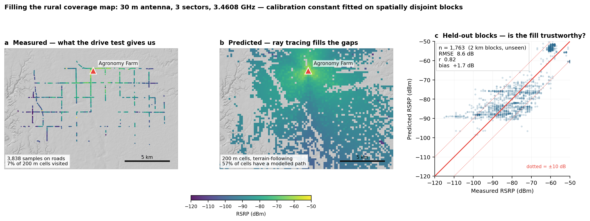

# Sionna approach — physics-based ray tracing

**ARATHON CHALLENGE 03** · Data-driven rural infrastructure placement

One of several approaches in this repository ([overview](../README.md)). This one builds a
geometric digital twin of the testbed and ray-traces it, rather than fitting a statistical
model to the measurements.

A ray-traced RF digital twin of the ARA rural COTS RAN testbed near Ames, Iowa. A UE
drive test covers 7% of the area; ray tracing over real terrain and building geometry
predicts the rest, and the predicted service surface becomes the input to a constrained
facility-location problem.



## Status

| Stage | State |
|---|---|
| Scene construction (terrain + OSM buildings, georeferenced) | **done** |
| Mitsuba export, Sionna RT loading, ITU materials | **done** |
| Propagation model calibrated against measured RSRP | **9 dB RMSE — usable, not yet good** |
| Predicted service surface over the unmeasured area | **done** |
| Facility-location optimisation | **not started** |

Honest headline: on spatially disjoint held-out blocks the twin reaches **RMSE 8.6 dB,
r = 0.82, bias +1.7 dB** (n = 1,763). 57% of grid cells get a modelled path; the rest are
a known gap, not an absence of coverage. Antenna height, tilt and EIRP are not in the
dataset — EIRP and gain are absorbed into one fitted constant, and height is currently
asserted at 30 m because it is **not identifiable** from the data (see `HANDOFF.md`).

## Quickstart

```bash
pip install sionna-rt
export DRJIT_LIBLLVM_PATH=/path/to/libLLVM.dylib   # Sionna will not import without this

cd scene
python predict_surface.py mitsuba/ames.xml 30 pred.npz 200
python make_figure.py pred.npz out.png
```

The 30 m Mitsuba scene is committed, so this runs on a fresh clone with no Blender and no
data downloads. [`bundle/README.md`](bundle/README.md) is the full guide, including the coordinate
conventions and the dead ends already ruled out.

## Rebuilding the scene from scratch

Only needed if you change the extent or add layers such as vegetation. Requires Blender
4.2 with the Blosm and Mitsuba addons.

```bash
cd scene
python clip_osm.py                                  # Geofabrik PBF -> ames.osm
BL=/Applications/Blender.app/Contents/MacOS/Blender
$BL -b -P import_scene.py                           # -> ames.blend
$BL -b -P verify_geo.py                             # -> georef.json
$BL -b -P export_mitsuba.py                         # -> mitsuba/ames.xml
```

Note this deliberately bypasses Blosm's OpenStreetMap download, which fails behind a busy
Overpass endpoint; both terrain and OSM are fed from local files.

## What has been ruled out

Recorded so nobody repeats them:

- **A finer DEM does not help.** USGS 3DEP 1/3 arc-second (10 m posts, 8.2M triangles)
  scores 9.14 dB against the 30 m mesh's 8.99 dB.
- **Diffraction makes the fit worse** (11.7 dB on 30 m terrain, 10.6 dB on 10 m). A
  tessellated DEM offers every triangle boundary as a spurious diffracting edge; it hurts
  less on the finer mesh, which is the signature of an artifact rather than physics.
- **`PathSolver` needs chunking.** 800 receivers solve in 15 s; a single 15,742-receiver
  call ran 30 minutes without finishing.

Still open: vegetation is excluded from the scene entirely, and Iowa shelterbelts attenuate
at 3.46 GHz even in a bare-field March. That is the leading remaining suspect.

## Layout

```
scene/        scene-building + simulation scripts and the 30 m Mitsuba scene
bundle/       self-contained copy for running simulations with no Blender
HANDOFF.md    full engineering log: verified facts, gotchas, open problems
```

All scripts resolve paths relative to their own location, so the tree can be cloned or
moved anywhere. The measurement data is found via `COTS_DATA=/path/to/COTS_Dataset`, or
automatically if an `extracted/COTS_Dataset/` sits above the repo.

## Licence

The measurement dataset is **Arathon-only while non-public** and is not in this repository.
It may not be copied, redistributed or published before ARA's official release, which
includes derived files carrying measurement values or coordinates — `.npz` surfaces and
figures plotting measured RSRP are excluded by `.gitignore` for that reason.

Scene geometry derives from **OpenStreetMap (© OpenStreetMap contributors, ODbL)** and
NASA SRTM / Mapzen terrain tiles; USGS 3DEP elevation is public domain. Attribute these in
any published figure.
